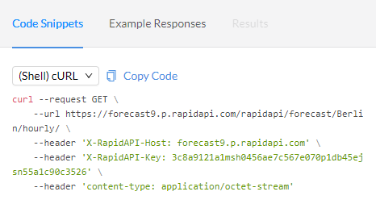
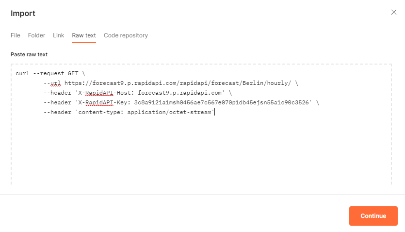
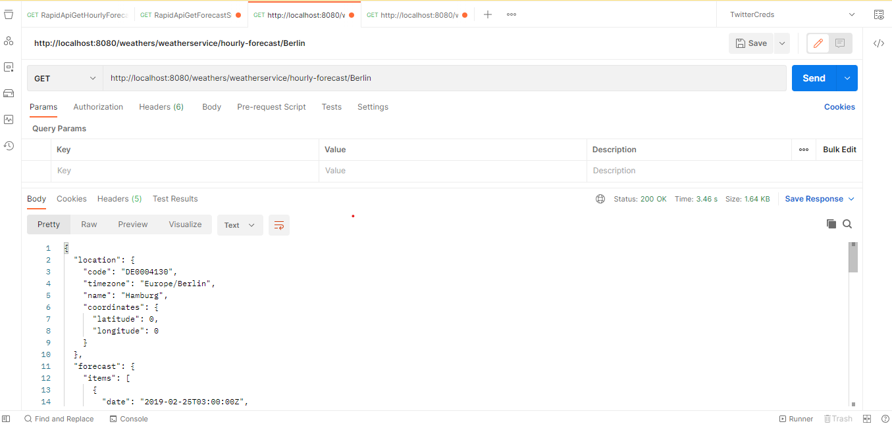
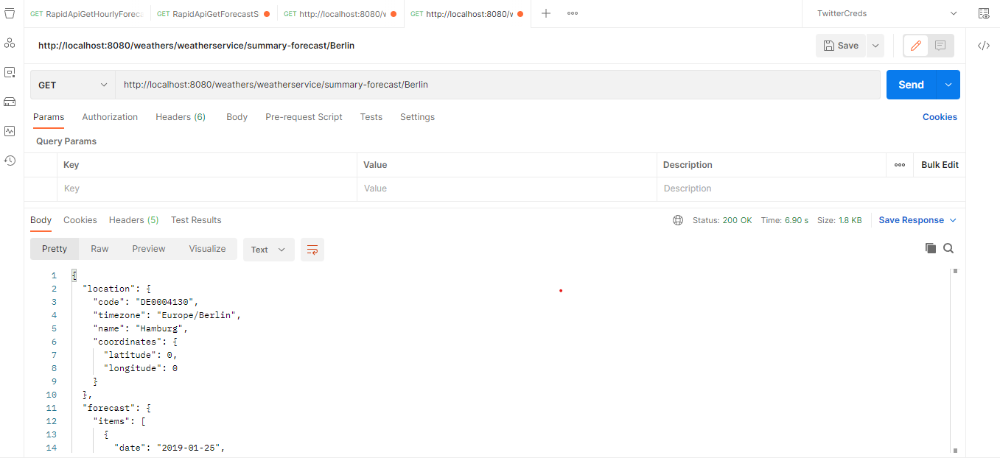

# WeatherApp

This repo will be consuming the api from RapidApi forecast collection

_**Technology Used :**_

Java 17

Spring Boot 3.0.6

Maven 3.8.4

Junit
 

_**Tools Used :**_

IntelliJ

Postman
 

_**APIs :**_

getWeatherForecastSummaryByLocationName :
{ENV_URL}/weathers/weatherservice/summary-forecast/{location}

getWeatherForecastHourlyByLocationName :
{ENV_URL}/weathers/weatherservice/hourly-forecast/{location}

 

_**How to use RapidApi endpoints:**_

The Forecast api used in this project -
[Forecast Api](https://rapidapi.com/wettercom-wettercom-default/api/forecast9)

Procedure to use :

1. Sign up for an account: Visit the RapidAPI website and create a new account. You can use your Google, GitHub, or
   LinkedIn account to sign up.
2. Find an API: Once you have signed up and logged in, you can browse the marketplace to find the APIs you need.
   RapidAPI offers APIs for a wide range of categories, including weather, sports, finance, and more.
3. Subscribe to the API: Once you find an API that you want to use, you need to subscribe to it. This involves selecting
   a pricing plan that suits your needs and providing any required payment information.
4. Get an API key: After subscribing to the API, you will be provided with an API key. This key is used to authenticate
   your requests to the API.
5. Use the API: Once you have your API key, you can start making requests to the API. You will typically need to provide
   parameters such as location, date, or other data to the API in order to get a response. RapidAPI provides
   documentation for each API that explains how to use it.

**To import in postman and test follow the below procedure :**

_Copy the curl_

 

_Paste the curl in postman:_

Postman collection is ready to use to test the forecast apis responses

_**NOTE**: As per the subscription plan there is certain daily limit for using the free requests._

 

_**Examples :**_

*Hourly Forecast*

 

*Forecast Summary*

 

In this example I have mocked the responses if the limit is exceeded of the Rapid Apis the Example responses will be
responded.

This project contains 2 api example consuming forecast rapid apis with the unit test cases for the same.

HttpCalling method - java.net.http ( Must be preferred to implement)

